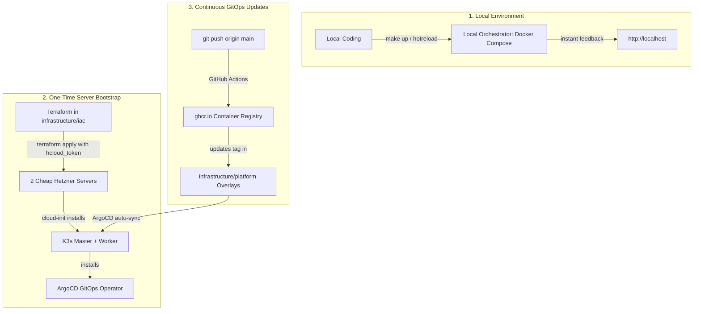
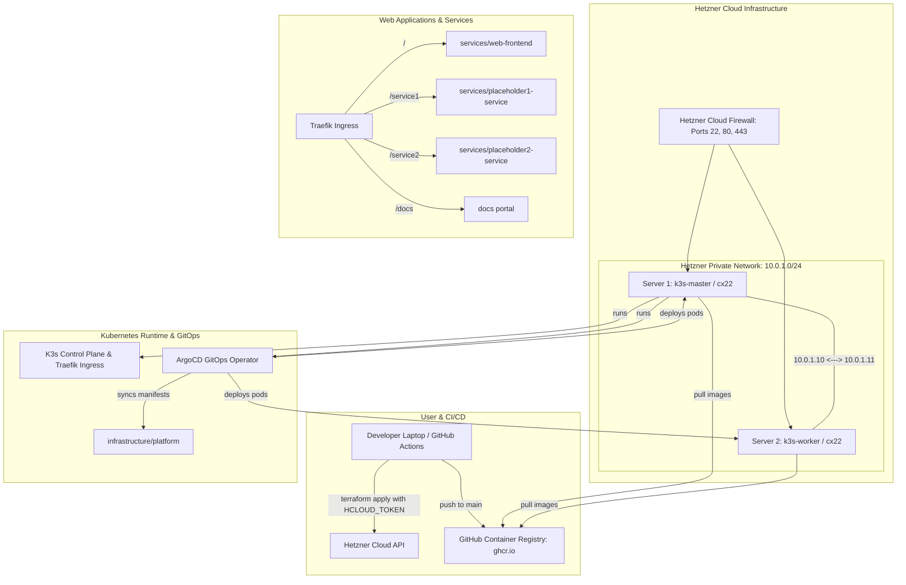

# Requirements

### Overview & Goals
Expand the workspace to deploy responsive websites and backend microservices onto 2 cost-effective Hetzner Cloud servers (`cx22` / `cpx11`) using declarative Terraform IaC with simple API key authentication (`hcloud_token`) and a seamless 3-tier lifecycle (Local, Staging, Prod):
1. **Simple Hetzner Key Configuration & IaC**: Clear, secure placement for the user's Hetzner API key (via `HCLOUD_TOKEN` environment variable or `git-repositories/infrastructure/iac/terraform.tfvars`), provisioning 2 cheap Hetzner Cloud servers (Master & Worker node), a private cloud network (`10.0.1.0/24`), and cloud firewall rules.
2. **2-Node Lightweight Kubernetes (K3s) Cluster**: Automated "bootstrap once" setup where Server 1 runs the K3s control plane and ArgoCD GitOps operator, and Server 2 connects as a worker node over the private network.
3. **Seamless 3-Tier Lifecycle (Local, Staging, Production)**:
   - **Local Environment**: Zero-cloud-cost development with `local-orchestrator` (`make up`, `make hotreload`) for instant feedback.
   - **Staging Environment**: GitOps overlay (`overlays/staging/`) on the cluster for testing release candidates before production.
   - **Production Environment**: Live production workloads (`overlays/production/`) auto-synced by ArgoCD from `ghcr.io` images.
4. **Dedicated Website Frontend (`services/web-frontend`)**: Create a modern, responsive website frontend in `services/` with local hot-reload orchestration, container packaging, and automated GitHub Actions CI/CD to GHCR.
5. **Pure GitOps "Bootstrap Once, Code Takes Over"**: Clear documentation in root `README.md` and component guides so users can spin up the servers in one step and subsequently deploy updates 100% via Git.

### Scope
#### In Scope
- **Hetzner API Key Setup Guide**: Dedicated setup instructions explaining where to obtain and place the `hcloud_token` (`export HCLOUD_TOKEN="..."` or `terraform.tfvars`).
- **Hetzner Cloud Terraform Modules**: Providers, variables, 2 server instances (`k3s-master` & `k3s-worker`), private vSwitch network (`10.0.1.0/24`), firewall rules, and SSH key management in `infrastructure/iac`.
- **2-Node Server Platform Definition**: Cloud-init definitions and native Go 1.26 platform CLI in `infrastructure/servers` supporting master installation and worker node joining.
- **Dedicated Website Frontend (`services/web-frontend`)**: Responsive website frontend with modern UI, static assets, backend API routing, Dockerfile, and GitHub Actions CI/CD pipeline.
- **Local Orchestrator Integration**: Adding the website frontend to `local-orchestrator` with compose definition and live hot-reload volume mounting.
- **GitOps Manifests & Ingress**: Kubernetes base manifests and environment overlays for Local/Staging/Prod, Traefik Ingress routing (`/` -> web-frontend, `/service1` -> placeholder1, `/service2` -> placeholder2, `/docs` -> docs), and ArgoCD application sync.
- **Step-by-Step Beginner-Friendly Documentation**: Comprehensive root `README.md` and module READMEs explaining Local development, Server initial setup, and Day-2 GitOps updates.

#### Out of Scope
- Multi-cloud federation or complex HA multi-master etcd setups (a lean 2-node master+worker topology keeps costs under ~€8/month).
- Proprietary closed-source deployment platforms outside GitHub Actions, Terraform, and ArgoCD.

### User Stories
- **As a Developer**, I want to know exactly where to put my Hetzner API key so I can run `terraform apply` and have 2 cheap cloud servers provisioned effortlessly.
- **As a Developer**, I want a clear guide showing how to run everything locally (`make up`), test in staging, and promote to production.
- **As an Operator**, I want to bootstrap the servers once and then manage all application updates purely through Git commits and ArgoCD reconciliation.
- **As a Visitor**, I want to access fast, responsive websites and API documentation securely over HTTPS.

### Functional Requirements
- **Hetzner API Key Placement**:
  - `git-repositories/infrastructure/iac/terraform.tfvars.example` documents `hcloud_token = "your-api-token-here"`.
  - `terraform.tfvars` is ignored in `.gitignore` to prevent secret leaks.
  - Supports standard `export HCLOUD_TOKEN="your-api-token"` without needing to edit files.
- **2 Cheap Server Definitions**: IaC defines 2 Hetzner Cloud VPS instances (default type `cx22` / ~€3.79/mo each) in European/US datacenters (e.g. `fsn1`, `nbg1`, or `hel1`).
- **Private Networking**: Both servers attach to a private Hetzner Cloud network (`10.0.1.0/24`) for inter-node K3s traffic and pod networking.
- **Cloud Firewall**: Hetzner Cloud Firewall allows incoming SSH (port 22), HTTP (port 80), HTTPS (port 443), and restricts K3s API (port 6443) to authorized administration IPs.
- **2-Node K3s Cluster Setup**:
  - Server 1 (`k3s-master`): Bootstraps K3s server, Traefik Ingress, and ArgoCD controller.
  - Server 2 (`k3s-worker`): Joins the cluster as a worker node via private network IP (`https://10.0.1.10:6443`) and cluster join token.
- **3-Tier Environment Support**:
  - **Local**: `local-orchestrator` with Docker Compose and hot-reloading.
  - **Staging**: Kustomize overlay `infrastructure/platform/overlays/staging/` deployed to `staging` namespace.
  - **Production**: Kustomize overlay `infrastructure/platform/overlays/production/` deployed to `production` namespace.
- **Website Frontend Service**: `services/web-frontend` serves responsive web pages, integrates with backend APIs, and supports live hot-reloading in `local-orchestrator`.
- **GitOps Continuous Deployment**: Changes pushed to `main` build Docker images to GHCR and automatically reconcile on the 2-node cluster via ArgoCD.

### Non-Functional Requirements
- **Cost Efficiency**: Total infrastructure cost kept under ~€8/month for 2 cloud servers.
- **Security**: No secrets or API keys stored in Git; private network isolation for inter-node communication; least-privilege firewall rules.
- **Developer Experience**: Clear, beginner-friendly instructions in `README.md` with copy-paste commands.

# Technical Design

### Current Implementation
- **Infrastructure IaC (`infrastructure/iac`)**: Contains baseline Terraform structure (`providers.tf`, `variables.tf`, `main.tf`, `outputs.tf`) ready to be configured with the official Hetzner Cloud provider (`hetznercloud/hcloud`).
- **Server Bootstrap (`infrastructure/servers`)**: Contains Go 1.26 platform CLI (`main.go`) and cloud-init definitions for single-node k3s, ready to be expanded for multi-node master/worker topology.
- **Services (`services/`)**: Currently contains `placeholder1-service` and `placeholder2-service` with Go backends, Dockerfiles, and CI/CD pipelines.
- **Local Orchestrator (`local-orchestrator/`)**: Modular Docker Compose with `compose/services.yml`, `compose/docs.yml`, and `compose/proxy.yml`.
- **GitOps State (`infrastructure/platform`)**: Contains Kustomize base manifests, ArgoCD application definitions (`staging.yml`, `production.yml`), and Traefik Ingress routes.

### Key Decisions
1. **Hetzner Cloud Provider & IaC Architecture (`infrastructure/iac`)**:
   - *Decision*: Use official `hetznercloud/hcloud` Terraform provider (~> 1.45) with sensitive `hcloud_token` variable, defining 2 `hcloud_server` resources (`k3s_master` and `k3s_worker`), `hcloud_network`, `hcloud_network_subnet`, and `hcloud_firewall`.
   - *Rationale*: Provides 100% declarative, reproducible server provisioning on Hetzner Cloud without manual web console configuration.
2. **2-Node K3s Topology (Master + Worker)**:
   - *Decision*: Configure Server 1 as K3s Master (running API server, scheduler, and ArgoCD) and Server 2 as K3s Worker (running application workload pods), communicating over private IP `10.0.1.10`.
   - *Rationale*: Maximizes workload memory and CPU availability across 2 cheap VPS nodes while keeping cluster architecture clean and standard.
3. **Dedicated Website Frontend (`services/web-frontend`)**:
   - *Decision*: Implement a dedicated web frontend application in `services/web-frontend` with responsive HTML5/Tailwind/CSS UI, health checks, and Docker multi-stage build.
   - *Rationale*: Decouples presentation logic from backend microservices and allows independent website deployment and styling.
4. **Unified Ingress & GitOps Routing**:
   - *Decision*: Expose the website frontend at root `/`, microservices at `/service1` and `/service2`, and docs at `/docs` through Traefik Ingress in `infrastructure/platform`.
   - *Rationale*: Provides a single entry point on standard HTTP/HTTPS ports across the 2-node cluster with automated SSL and path routing.
5. **GitOps Lifecycle: Bootstrap Once, Code Takes Over**:
   - *Decision*: Terraform is run once to bring up the 2 servers and install K3s + ArgoCD. From that point on, all application and website deployments are managed exclusively by ArgoCD tracking the Git repository.
   - *Rationale*: Eliminates fragile SSH scripting during releases and ensures Git is always the single source of truth for deployment state.

### Hetzner API Key & Secret Management Guide
To make deploying to Hetzner Cloud simple and completely safe:
1. **Where to get the token**: In Hetzner Cloud Console (`https://console.hetzner.cloud`), go to your Project -> **Security** -> **API Tokens** -> click **Generate API Token** (Read & Write permissions).
2. **Option A (Recommended for simplicity - `terraform.tfvars`)**:
   - In `git-repositories/infrastructure/iac/`, copy `terraform.tfvars.example` to `terraform.tfvars`:
     ```bash
     cp terraform.tfvars.example terraform.tfvars
     ```
   - Open `terraform.tfvars` and paste your token:
     ```hcl
     hcloud_token = "your-hetzner-api-token-here"
     ssh_public_key = "ssh-ed25519 AAAAC3NzaC1lZDI1NTE5AAAAI..."
     ```
   - Note: `terraform.tfvars` is listed in `.gitignore` so your API key will **never** be committed to Git.
3. **Option B (Environment Variable)**:
   - Set in your terminal before running Terraform:
     ```bash
     export HCLOUD_TOKEN="your-hetzner-api-token-here"
     ```

### 3-Tier Lifecycle & GitOps Guide (Local, Staging, Production)



#### Tier 1: Local Environment (Local Orchestrator)
- Run `make up` to start all services, docs, and the website frontend locally with Docker Compose.
- Run `make hotreload` to mount source code directly into containers for instant UI and backend updates without rebuilding images.
- Fully offline and free of cloud costs.

#### Tier 2: Staging Environment (`staging` Namespace)
- Managed via `git-repositories/infrastructure/platform/overlays/staging/`.
- Deploys preview versions and release candidates onto the cluster.
- Uses lower replica counts and staging-specific environment configs.

#### Tier 3: Production Environment (`production` Namespace)
- Managed via `git-repositories/infrastructure/platform/overlays/production/`.
- ArgoCD continuously monitors `infrastructure/platform` on Git.
- When new images are built by GitHub Actions upon merging to `main`, ArgoCD pulls the latest image from `ghcr.io` and updates the live production pods with zero downtime.

#### "How to Setup the Server Once, Then Update Everything via Git"
1. **Day 0 (Initial Bootstrap - 2 Minutes)**:
   ```bash
   cd git-repositories/infrastructure/iac
   cp terraform.tfvars.example terraform.tfvars
   # Add your hcloud_token and ssh_public_key to terraform.tfvars
   terraform init
   terraform apply
   ```
   *Outcome*: 2 Hetzner servers are provisioned, private network is configured, K3s master and worker join, and ArgoCD starts syncing.
2. **Day 1+ (Pure GitOps Updates - No SSH, No Manual Commands)**:
   - Edit website files in `git-repositories/services/web-frontend/static/` or Go services.
   - Commit and push to `main`.
   - GitHub Actions builds container images to GHCR.
   - ArgoCD reconciles the cluster automatically. You are live!

### Proposed Architecture



### Component Breakdown & Contracts

#### 1. Hetzner Cloud IaC (`git-repositories/infrastructure/iac`)
- `providers.tf`: Adds `hetznercloud/hcloud` provider alongside `cloudinit`, `local`, and `tls`.
- `variables.tf`:
  - `hcloud_token` (string, sensitive): Hetzner API key.
  - `server_type` (string, default `"cx22"`): Cheap x86 compute instance (~€3.79/month).
  - `server_location` (string, default `"fsn1"`): Falkenstein datacenter.
  - `ssh_public_key` (string): Public key for administrative SSH access.
  - `k3s_cluster_token` (string, sensitive): Shared cluster secret for node join.
- `network.tf`: Defines `hcloud_network` (`10.0.0.0/16`) and `hcloud_network_subnet` (`10.0.1.0/24`).
- `firewall.tf`: Defines `hcloud_firewall` with inbound TCP 22, 80, 443, and intra-network private traffic.
- `main.tf`: Provisions `hcloud_server.k3s_master` (private IP `10.0.1.10`) and `hcloud_server.k3s_worker` (private IP `10.0.1.11`), attaching cloud-init payloads.
- `outputs.tf`: Exports `master_public_ip`, `worker_public_ip`, `ssh_master_command`, `ssh_worker_command`, and `kubeconfig_command`.
- `terraform.tfvars.example`: Example template for setting `hcloud_token` and SSH keys.

#### 2. Server Platform & 2-Node Bootstrap (`git-repositories/infrastructure/servers`)
- `cloud-init-master.yaml`: Cloud-init configuration for Master node (installs K3s server with `--cluster-init` or cluster token, binds to private network, configures firewall).
- `cloud-init-worker.yaml`: Cloud-init configuration for Worker node (installs K3s agent, joins master via `K3S_URL=https://10.0.1.10:6443` and `K3S_TOKEN`).
- `main.go` (Go 1.26 Platform CLI): Supports commands `setup-master`, `setup-worker`, `bootstrap-argocd`, and `status`.

#### 3. Dedicated Website Frontend (`git-repositories/services/web-frontend`)
- `main.go` / `server.go`: Lightweight Go 1.26 HTTP server with embedded static assets (`index.html`, CSS, JS) and API proxying.
- `static/`: Responsive landing page with workspace navigation, service status cards, documentation links, and dark/light UI.
- `Dockerfile`: Multi-stage Dockerfile producing a minimal container image.
- `.github/workflows/ci-cd.yml`: GitHub Actions pipeline building and publishing `ghcr.io/lmbek/lmbek-hobby-web-frontend:${{ github.sha }}` and `:latest`.

#### 4. Local Orchestrator (`local-orchestrator/`)
- `compose/websites.yml`: Defines the `web-frontend` container service connected to `hobby-internal` and `hobby-public` networks.
- `docker-compose.yml`: Includes `compose/websites.yml`.
- `hotreload/mounts/websites.yml`: Mounts `./git-repositories/services/web-frontend` for instant live reload.

#### 5. Platform & GitOps Manifests (`git-repositories/infrastructure/platform`)
- `base/websites/`: Deployment and Service manifests for `web-frontend`.
- `base/ingress.yml`: Traefik Ingress routing root path `/` to `web-frontend`, `/service1` to `placeholder1-service`, `/service2` to `placeholder2-service`, and `/docs` to `docs`.
- `overlays/staging/` & `overlays/production/`: Environment overlays for websites and services with GHCR image tags.

### File Structure
```
git-repositories/
├── infrastructure/
│   ├── iac/
│   │   ├── main.tf
│   │   ├── network.tf
│   │   ├── firewall.tf
│   │   ├── variables.tf
│   │   ├── outputs.tf
│   │   ├── providers.tf
│   │   ├── terraform.tfvars.example
│   │   └── README.md
│   ├── servers/
│   │   ├── cloud-init-master.yaml
│   │   ├── cloud-init-worker.yaml
│   │   ├── main.go
│   │   ├── go.mod
│   │   └── README.md
│   └── platform/
│       ├── argocd/
│       │   ├── staging.yml
│       │   └── production.yml
│       ├── base/
│       │   ├── websites/
│       │   │   ├── deployment.yml
│       │   │   ├── service.yml
│       │   │   └── kustomization.yml
│       │   ├── applications/
│       │   ├── docs/
│       │   ├── ingress.yml
│       │   └── kustomization.yml
│       └── overlays/
│           ├── staging/
│           └── production/
├── services/
│   ├── web-frontend/
│   │   ├── static/
│   │   │   ├── index.html
│   │   │   ├── style.css
│   │   │   └── app.js
│   │   ├── main.go
│   │   ├── go.mod
│   │   ├── Dockerfile
│   │   ├── .github/workflows/ci-cd.yml
│   │   └── README.md
│   ├── placeholder1-service/
│   └── placeholder2-service/
└── docs/
local-orchestrator/
├── docker-compose.yml
├── compose/
│   ├── websites.yml
│   ├── services.yml
│   ├── docs.yml
│   └── proxy.yml
└── hotreload/
    ├── docker-compose.yml
    └── mounts/
        ├── websites.yml
        ├── services.yml
        └── docs.yml
```

### Risks & Mitigations
- **Hetzner API Key Leakage**:
  - *Risk*: Committing API token to Git.
  - *Mitigation*: Marked `hcloud_token` as `sensitive = true` in Terraform, added `.tfvars` to `.gitignore`, and provided `terraform.tfvars.example`.
- **Cluster Join Race Condition**:
  - *Risk*: Worker node tries to join before Master node finishes K3s initialization.
  - *Mitigation*: Worker cloud-init includes retry loop waiting for Master K3s API endpoint (`https://10.0.1.10:6443/ping`) to become healthy before starting `k3s-agent`.
- **Node Resource Exhaustion on Cheap VPS**:
  - *Risk*: 2 Cheap VPS instances (`cx22` / 2 vCPU, 4 GB RAM) running out of memory.
  - *Mitigation*: K3s lightweight footprint (<512 MB memory), Traefik embedded ingress, and resource requests/limits defined in Kustomize manifests.

# Testing

### Validation Approach
Verification consists of validating Terraform Hetzner configuration syntax, checking cloud-init templates, testing K3s cluster node registration, verifying web frontend rendering and hot-reload, and confirming end-to-end GitOps deployment.

### Key Scenarios
1. **Terraform Hetzner Configuration Validation**:
   - Verify `terraform fmt -check` and validate provider schemas for `hetznercloud/hcloud`.
   - Confirm generated cloud-init payloads contain correct private IPs and tokens.
2. **2-Node K3s Cluster Formation**:
   - Verify that Master node initializes K3s server on `10.0.1.10`.
   - Verify that Worker node connects over private network and `kubectl get nodes` reports 2 nodes in `Ready` state (`k3s-master` and `k3s-worker`).
3. **Website Frontend Rendering & Local Orchestrator**:
   - Verify `web-frontend` runs locally via `make up` in `local-orchestrator`.
   - Verify web frontend responds with HTTP 200 on port 80/8080 and proxies backend services.
   - Verify hot-reload updates UI instantly upon editing static files.
4. **GitOps Ingress & Workload Sync**:
   - Verify `kubectl kustomize base` renders valid Deployment, Service, and Ingress manifests for `web-frontend`.
   - Verify ArgoCD applications sync workloads across the 2 cluster nodes.
5. **Go Platform CLI Diagnostics**:
   - Verify `go run . help` in `infrastructure/servers` lists `setup-master` and `setup-worker` commands.

### Edge Cases
- **Worker Node Reboot / Network Reconnect**: Ensure `systemd` unit `k3s-agent` automatically reconnects to Master on reboot.
- **Missing Hetzner Token**: Ensure Terraform outputs a helpful descriptive error if `HCLOUD_TOKEN` is unset.
- **Port Conflicts & SSL Ingress**: Ensure Ingress routes handle both local HTTP (local-orchestrator) and production HTTPS (Traefik) seamlessly.

# Delivery Steps

### ✓ Step 1: Configure Hetzner Cloud Terraform IaC for 2 Cheap Servers & Private Network
Declarative Terraform modules provision 2 cheap Hetzner Cloud VPS instances, a private cloud network, and a firewall in `git-repositories/infrastructure/iac`.

- Add `hetznercloud/hcloud` provider and configuration in `providers.tf`.
- Define variables (`hcloud_token`, `server_type`, `server_location`, `k3s_cluster_token`, `ssh_public_key`) in `variables.tf`.
- Create `network.tf` defining `hcloud_network` (`10.0.0.0/16`) and `hcloud_network_subnet` (`10.0.1.0/24`).
- Create `firewall.tf` defining `hcloud_firewall` for SSH (22), HTTP (80), HTTPS (443), and internal private network traffic.
- Create `main.tf` provisioning `hcloud_server.k3s_master` and `hcloud_server.k3s_worker` with attached cloud-init and private network IPs.
- Add `terraform.tfvars.example` and update `outputs.tf` with connection parameters and kubeconfig export commands.
- Document the exact location and methods for providing the Hetzner API token (`terraform.tfvars` or `HCLOUD_TOKEN` env var) in `infrastructure/iac/README.md`.

### ✓ Step 2: Implement 2-Node K3s (Master + Worker) Cloud-Init and Platform Bootstrap CLI
Idempotent cloud-init scripts and Go 1.26 platform CLI commands configure the 2-node K3s cluster in `git-repositories/infrastructure/servers`.

- Create `cloud-init-master.yaml` for Master node setup with K3s server, Traefik Ingress, and cluster token.
- Create `cloud-init-worker.yaml` with retry loop to join the Master node over private IP `10.0.1.10`.
- Update native Go 1.26 platform CLI (`main.go`) to support `setup-master`, `setup-worker`, and `bootstrap-argocd`.
- Update `infrastructure/servers/README.md` with multi-node operational runbooks.

### ✓ Step 3: Develop Dedicated Website Frontend Service with Hot-Reload & CI/CD Pipeline
A responsive website frontend application with local hot-reload and automated CI/CD is created in `git-repositories/services/web-frontend`.

- Create `services/web-frontend` with Go 1.26 HTTP server, static HTML/CSS/JS landing page, and status dashboards.
- Add multi-stage `Dockerfile` and `.dockerignore`.
- Create `.github/workflows/ci-cd.yml` for automated Docker builds and publishing to `ghcr.io/lmbek/lmbek-hobby-web-frontend`.
- Add `compose/websites.yml` and `hotreload/mounts/websites.yml` in `local-orchestrator`.
- Register `web-frontend` in `git-repositories/repo-definition.yaml`.

### ✓ Step 4: Update Platform Manifests, Ingress Routing, and GitOps State for Web Workloads
Kubernetes base manifests, environment overlays, and Traefik Ingress routing are updated in `git-repositories/infrastructure/platform`.

- Create `base/websites/` with Deployment, Service, and Kustomize definitions for `web-frontend`.
- Update `base/ingress.yml` to route root `/` to `web-frontend`, `/service1` to `placeholder1-service`, `/service2` to `placeholder2-service`, and `/docs` to `docs`.
- Update `overlays/staging/` and `overlays/production/` Kustomize definitions with website image tags and resource allocations.
- Update `argocd/staging.yml` and `argocd/production.yml` to track the updated platform repository state.

### ✓ Step 5: End-to-End Infrastructure Validation, Deployment Testing, and Runbook Documentation
The complete multi-server setup, local orchestration, and GitOps deployment pipeline are validated and documented with easy beginner-friendly guides.

- Validate Terraform configurations, Kustomize manifests, and GitHub Actions workflows.
- Verify `local-orchestrator` starts all services including `web-frontend` via `make up`.
- Run unit tests across `git-controller` and platform bootstrap tools.
- Update workspace `README.md` with an intuitive, step-by-step Quick Start guide detailing:
  1. Local environment workflow (`make up` / `make hotreload`).
  2. One-time Hetzner server setup (where to paste the API key and run `terraform apply`).
  3. Continuous GitOps update workflow (pushing to `main` and automated ArgoCD reconciliation).
  4. Staging vs Production promotion.